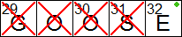
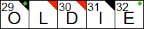

Checking and Revealing the Solution
-----------------------------------

There are several options to check or reveal letters in the grid.  You can check
or reveal the current letter or word, the entire grid, or a
[section](#checking_or_revealing_a_selection) of the grid.  You can also reveal
only the incorrect letters in the grid (blank squares will remain blank).

When you check the grid incorrect letters are shown with a red X through
them.  If you type over an incorrect letter the X is replaced by a black "flag"
(a triangle) in the upper right corner of the square indicating that the square
was checked and found to be incorrect at some point.  When a letter is revealed
it gets a red flag in the upper right corner. If a square is checked and found
to be correct, this is indicated by a green circle in the top right corner.  

You cannot overwrite squares that have been revealed (red flag) or checked and
found to be correct (green circle).

### Checking the solution as you type ###

XWord can be configured to check squares automatically, marking correct and
incorrect letters as you type.  This option can be found on the
[solving](preferences.html#solving_preferences) page of the preferences dialog.

### Checking or revealing a selection ###

To check or reveal a section of the grid, click on `Check Selection...` or
`Reveal Selection...` from the [`Solution`](window.html#solution_menu) menu.
The cursor will turn into crosshairs allowing you to make a selection.  Click
anywhere in the grid to start the selection, drag to make the selection, and
release the mouse to complete the selection.  The selected area will be checked
or revealed.  If you want to cancel the selection, press the `Esc` key.

### Uncheckable puzzles ###

Some puzzles do not have a solution (e.g. contest puzzles), or have their
solution [scrambled](window.html#unscrambling).  The check and reveal menu and
toolbar items will be diabled in this case.  If the solution is scrambled, XWord
can still check if the solution is correct once the puzzle is complete.