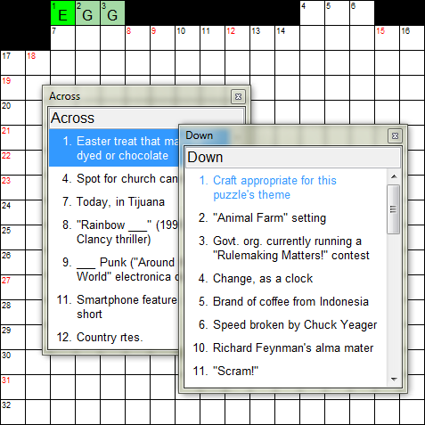

Diagramless Puzzles
-------------------

Solving diagramless puzzles interactively is similar to [solving](solving.html)
normal puzzles with the notable exception that you have to place black
squares yourself to fill in the grid.  When a black square is focused, the cursor
becomes an outline of the square instead of solid.

### To toggle a square between black and white ###
1. [Navigate](navigation.html) to the square:
    - Left-click the square or
    - Navigate using the arrow keys
2. Press the "." key (period/dot).

When a black square is added or removed, XWord dynamically updates the clue
numbers in the grid.  As an aid to solving, if a clue number appears that is
not possible, based on the Across and Down clues, it is drawn in red instead
of the normal black.

In the picture, based on the black squares entered, there should be an 8-down
(and for that matter, a 9-down), but neither 8- nor 9-down appear in the clue
list (in fact, they are across clues), so they are drawn in red.  The grid
needs to have more black squares added to satisfy the constraints of the clues.

