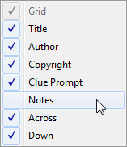

Window Layout
-------------

XWord allows the user to adjust the window layout by rearranging panes.  To
put XWord in layout mode, select `Edit Layout` from the
[`View`](window.html#view_menu) menu, or press the `Edit Layout` toolbar
button.  Each pane will now display a title bar with several buttons.

### Pane Buttons ###

- Clicking the X button will close (hide) the pane.
- Clicking pin button will minimize the pane to a tab on the side of the screen.
    - To temporarily show the pane, hover over the tab.
    - To restore the pane, double-click the tab.

### Rearranging Panes ###

To move a pane, click and drag on the title bar. The pane will pop out of the
layout into a new floating window.  To add a pane back to the layout, drag it
where you want the pane.  The main window will display a shaded area where the
pane will be placed (this area is shaded blue in the image).  Release the
mouse to drop the pane in place.  To prevent docking a pane that is floating
hold the `ALT` key.

The layout of each pane can also be changed by right-clicking on the pane to
display a context menu.  For clue lists you must right-click on the list title
to get a context menu.

Panes can be hidden or shown through the `Panes` submenu of the `View` menu.
This is especially useful if you accidentally close a pane.

### Saved Layouts ###

XWord comes with several predefined layouts to choose from.  These layouts
can be accessed by selecting `Load Layout` from the `View` menu.  You can
preview each layout by single-clicking its name before you change the layout.
If you have created a layout that you would like to save for the future, select
`Save Layout` from the same menu to add your layout to this list.  XWord saves
the current layout when it is closed, so it is not necessary to save the layout
every time you run the program.

