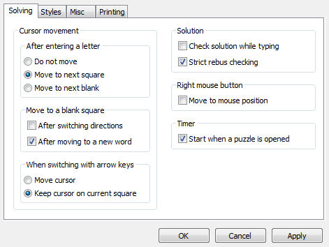
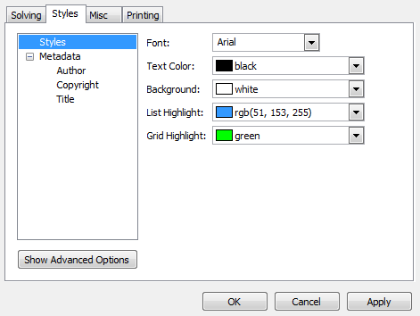
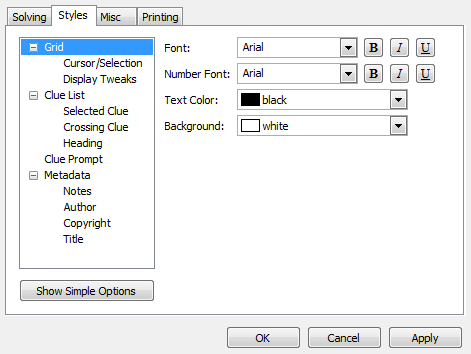
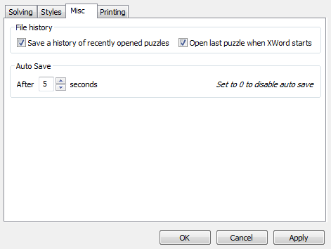
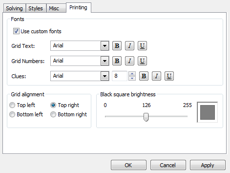

Preferences
-----------

The preferences dialog can be opened from the `File` menu and contains many
sub-categories:

### Solving Preferences ###

The Solving preferences page contains preferences related to
[grid navigation](navigation.html), solution checking, the timer,
and auto saving.

#### Strict rebus checking ####

- If this box is checked, squares with [rebus entries](solving.html#rebus_entries)
  for solutions will only be counted as correct if you enter a matching rebus
  entry.
- If this box is unchecked, squares with rebus entries for solutions will
  also be marked correct if you enter the first letter of the correct rebus entry.

### Styles ###

The styles page contains preferences related to visual display.  You can use
a simple or advanced configuration options.

#### Simple Styles ####

The simple settings page has options for global font, text and background color,
list and grid highlight colors, as well as text alignment for the
[metadata panels](window.html#metadata).

#### Advanced Styles ####

The advanced settings page allows you to change nearly every color and font used
for display.  You can change what information is displayed in metadata
panels and the clue prompt (context help is available in the preferences dialog), 
and the way the grid is presented.

### Miscellaneous Preferences ###

This page contains file history and auto save preferences.

### Printing Preferences ###

This page allows the user to change grid placement, brightness of the black
squares (to save ink), and to select fonts to be used for printing.

#### Fonts ####
If `Use custom fonts` is checked, the following fonts can be changed:

- Grid text
- Grid numbers
- Clues

If `Use custom fonts` is left unchecked, the appropriate values from the font
preferences page will be used for printing.

#### Black square brightness ####
The scale of black square brightness can be adjusted from 0 (black) to
255 (white).