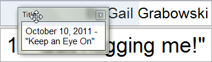
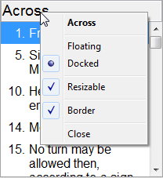
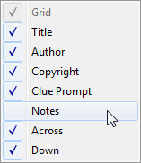
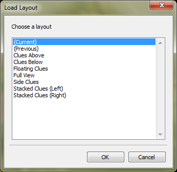

Window Layout
-------------

XWord allows you to adjust the window layout by rearranging panes.  To put
XWord in layout mode, select `Edit Layout` from the
[`View`](window.html#view_menu) menu, or press the `Edit Layout` toolbar
button.  In layout mode the cursor becomes a crosshair when hovered over panes
that can be moved, and each pane shows resizing borders.

### Rearranging Panes ###

To move a pane, click and drag over any part of the pane. The pane will pop out
of the layout into a new floating window.  To add a pane back to the layout,
drag it where you want the pane.  The main window will display a shaded area
where the pane will be placed (this area is shaded blue in the image).  Release
the mouse to drop the pane in place.  To prevent docking a pane that is
floating hold the `ALT` key.

#### Context Menu ####

The layout and visual display of each pane can also be changed by right-clicking
on the pane to display a context menu.  Panes that can be moved (all except the 
grid pane) have options to float or dock the pane.  All panes can be configured
to have a small border or to be resizable outside of layout mode.  Note that
visual changes will apply after you exit layout mode.

#### Panes Menu ####

Panes can be hidden or shown through the `Panes` submenu of the `View` menu.
This is especially useful if you accidentally close a pane.

### Saved Layouts ###

XWord comes with several predefined layouts to choose from.  These layouts
can be accessed by selecting `Load Layout` from the `View` menu.  You can
preview each layout by single-clicking its name before you change the layout.
If you have created a layout that you would like to save for the future, select
`Save Layout` from the same menu to add your layout to this list.  XWord saves
the current layout when it is closed, so it is not necessary to save the layout
every time you run the program.

