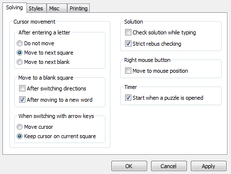
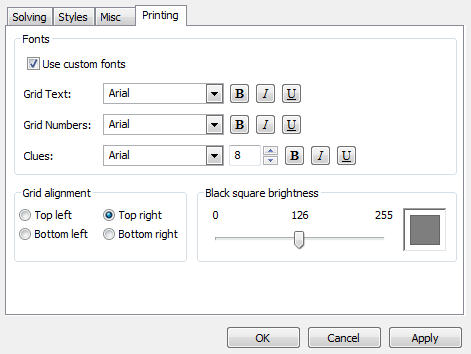

Preferences
-----------

The preferences dialog can be opened from the `File` menu and contains many
sub-categories:

### Solving Preferences ###

The Solving preferences page contains preferences related to
[grid navigation](navigation.html), solution checking, the timer,
and auto saving.

#### Strict rebus checking ####

- If this box is checked, squares with [rebus entries](solving.html#rebus_entries)
  for solutions will only be counted as correct if the user enters a
  matching rebus entry.
- If this box is unchecked, squares with rebus entries for solutions will
  also be counted as correct if the user enters only the first letter
  of the correct rebus entry.

#### Auto save ####

Auto save puzzles (if they are not temporary files) X seconds after the
last letter was filled into the grid.  Auto save is disabled if this value is 0.

### Color Preferences ###

The Color preferences page allows the user to change nearly every color that
XWord uses to display a crossword puzzle.

- Multi-square selection
    - The color that is used to highlight squares in the grid when the user
      selects multiple squares (for Check and Reveal section commands).
- Grid background
    - The color used to fill the background when the grid does not take up the
      entire window.

### Font Preferences ###

Note that text is scaled to fit the allotted space in many places, so font
size is irrelevant to several of these font choices:

- Text entered into the grid by the user
- Clue numbers in the grid
- The main clue prompt

### Miscellaneous Preferences ###

This page contains file history preferences as well as various tweaks.

#### Clue prompt format ####

The clue prompt can be formatted using simple HTML.  `"%T"` will be replaced
by the clue text, and `"%N"` by the clue number.  The clue is centered and
includes the clue number by default.

#### Grid tweaks ####

This section allows the user to make minor aesthetic changes to the way
the grid is presented by changing the size of grid text and numbers and the
thickness of the lines in the grid.

### Printing Preferences ###

This page allows the user to change grid placement, brightness of the black
squares (to save ink), and to select fonts to be used for printing.

#### Fonts ####
If `Use custom fonts` is checked, the following fonts can be changed:

- Grid text
- Grid numbers
- Clues

If `Use custom fonts` is left unchecked, the appropriate values from the font
preferences page will be used for printing.

#### Black square brightness ####
The scale of black square brightness can be adjusted from 0 (black) to
255 (white).