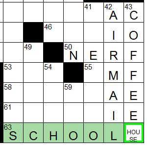

Entering Letters in the Grid
----------------------------

To enter a letter into a square, [navigate](navigation.html) to the square and
type a letter.
The focused word is highlighted in one color, and the focused square is
highlighted in a different color.  Unless configured otherwise, the focused
square will move to the next square in the current word when a letter is typed.

XWord supports entering any printable character[^1] in a square, including
symbols, however certain puzzle formats (such as .puz) only support a limited
character set.

### Erasing Letters ###
- `BACKSPACE` erases the letter in the current square and moves the cursor
   backward one square.
- `DELETE` erases the letter in the current square and does not move
   the cursor.
- `SPACE` erases the letter in the current square and moves the cursor
   forward one square.
- The [`Solution`](window.html#solution_menu) menu contains two erasing items:
    - `Erase Grid` clears the grid and resets the timer.
    - `Erase Uncrossed Letters` erases letters in the current word that are
       not part of an already filled word.

### Rebus Entries ###

Some puzzles require multiple letters to be entered in a square.

1. Press the `INSERT` key to enter rebus mode (the cursor will become an outline).
2. Type multiple letters.
    - `BACKSPACE` can be used to remove letters (from the end).
    - `DELETE` will remove letters from the beginning.
    - `CTRL+BACKSPACE` or `CTRL+DELETE` will delete all letters in the square.
3. Press INSERT or ENTER to exit rebus mode (the cursor will become solid again).

Rebus entries longer than 4 characters are wrapped.  Entries longer than 10
characters are truncated (for display only; XWord supports unlimited rebus
entry length).  If the mouse is hovered over a rebus entry, a tool tip will
pop up and display the entire entry (useful for truncated entries).

### Webdings Symbols ###

Across Lite allows users to enter symbols from the Webdings font.
If Webdings is installed, XWord will display these symbols, but it does not
support entering Webdings symbols.

### Circles ###

As a legacy holdover from Across Lite, typing an asterisk (\*) will toggle a
circle in the current square.

[^1]: A few reserved characters are not allowed to be entered as text: <code>: . [ </code>and<code> *</code>