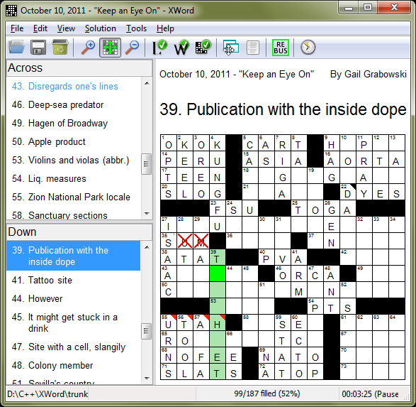

The Main Window
---------------

<!-- Fancy image map -->

<!-- The rectangles -->

    

    

    

    

    

    

    

    

    

    

    

    

    

    

    

    

    

    

    

    

    

    

<!-- Information -->

### Panes ###

#### Clue Prompt ####

The clue prompt displays the currently focused clue in large text.  Clues with
text that exceeds the boundary of the clue prompt will be shrunken and wrapped
to fit.  If the text cannot be shrunken and wrapped sufficiently to read it,
the clue prompt will have a tooltip with the current clue.

#### Clue Lists ####

XWord supports unlimited clue lists, though the vast majority of puzzles will
have just Across and Down clues.  Clues with text that exceeds the boundary
of the clue list will be wrapped.  The currently focused clue is highlighted,
and the clue that crosses the focused letter is highlighted in a different
color.  Clicking on a clue in a clue list will make that clue the focused word.

#### Title, Author, Copyright ####

If a puzzle contains a title, the author's name, or a copyright, these will be
displayed in their own panes.

#### Notes ####

Notes are read-only and can contain simple xhtml formatting.  Show and hide the
notes window using the [`View`](#view_menu) menu, the toolbar buttons, or the
[context menu](layout.html#context_menu) or
[close button](layout.html#pane_buttons) on the pane.  If a puzzle has notes,
the toolbar icon will turn yellow.

### File Menu ###

The file menu contains menu items for opening, saving, and deleting puzzles,
printing, and the [preferences](preferences.html) dialog.

#### Opening Puzzles ####

Puzzles can be opened by selecting `Open` from the `File` menu, by clicking
on the `Open Puzzle` toolbar button, by drag-and-drop, or by a puzzle
downloader [package](packages.html).

#### Saving Puzzles ####

Puzzles can be saved by selecting `Save` or `Save As` from the `File` menu,
or by clicking on the `Save Puzzle` toolbar button.  If no modifications have
been made to the puzzle, the `Save Puzzle` toolbar button will be disabled.
XWord can also be set to [auto save](preferences.html#auto_save) puzzles after
a certain amount of time.

#### Printing Puzzles ####

XWord prints puzzles on a single page, attempting to achieve the correct
balance between readable clues and a large grid.  Puzzles can be printed with
a blank grid, as currently solved, or with the solution.

### View Menu ###

The view menu contains grid sizing options and menu items related to adjusting
the [window layout](layout.html)

#### Grid Size ####

The grid can be zoomed in and out, or sized to fit the window.  If the grid
is zoomed in, scrollbars appear in the grid.  As the cursor is
[moved](navigation.html) around the grid, the currently focused area
automatically scrolls into view.

### Solution Menu ###

The solution menu allows the user to [check, reveal](check.html),
[erase](solving.html#erasing_letters), or [unscramble](#unscrambling) the grid,
and enter [multiple letters](solving.html#rebus_entries) in a square.

#### Unscrambling ####

Some .puz files come with a scrambled solution.  To unscramble the solution,
you need a 4-digit code.  Puzzles with scrambled solutions will have the
check and reveal solution menus and buttons disabled.  If a scrambled puzzle
has been filled in, XWord *will* alert the user if the puzzle is filled
correctly or incorrectly.

### Tools Menu ###

The tools menu allows the user to toggle the [timer](#timer) and install or
uninstall [packages](packages.html).  Packages typically add menu items to the
tools menu.

#### Timer ####

XWord includes a timer so you can keep track of how long it takes you to solve
puzzles.  The solving time is displayed in the bottom right corner in the
[status bar](#status_bar).  The timer can optionally be made to start when
a puzzle is opened (see [preferences](preferences.html#solving_preferences)).

### Help Menu ###

The help menu contains an about dialog, the [license](license.html), and links
to these help files.

### Status Bar ###

The status bar displays various information about the current puzzle, including
the following:

- The filename
- Solving [time](#timer)
- When the puzzle is filled in, a section of the status bar will display a
  message and change color depending on whether the puzzle is correct or not.
- Errors encountered in [packages](packages.html)